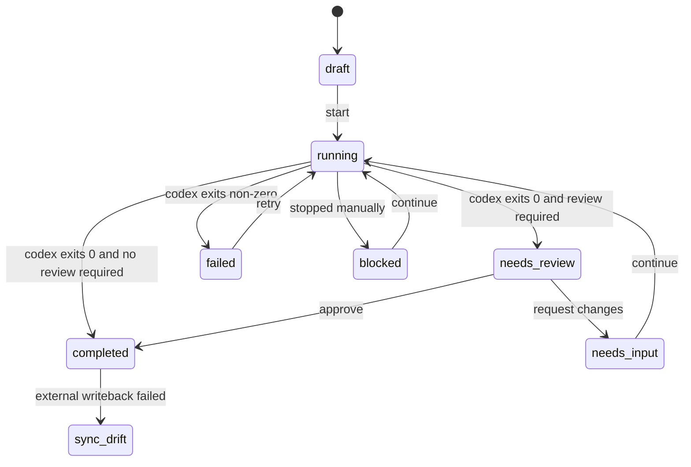

# Codex Manager Architecture

## Goal

Codex Manager is a local operator cockpit for Codex tasks. It borrows Symphony's runner,
workspace, tracker, and observability boundaries, and now exposes both operating shapes:

- `local_cockpit`: local task state is the source of truth and all derived progress is visible.
- `symphony_blackbox`: the UI collapses internal Codex events and shows only scheduler lifecycle,
  handoff, tracker sync, and workspace proof.

The cockpit mode directly addresses the black-box limitation of a pure Symphony-style daemon:

- every task has a structured checklist;
- every run writes events to a persistent stream;
- Codex JSONL events are preserved separately from derived UI state;
- Human Review is a first-class status and workflow action;
- external trackers sync into the local model instead of replacing it.

The blackbox mode is intentionally reversible. It keeps the same persistent task/event store and
runner, but hides the low-level stream so the user can experience a closer Symphony daemon shape.

## Core Model

- `Task`: canonical local task across local, GitHub, and GitLab sources.
- `ChecklistItem`: visible progress steps updated by the runner and review flow.
- `TaskEvent`: append-only task timeline for orchestration, Codex events, sync, and review.
- `ExternalRef`: GitHub/GitLab binding for later bidirectional sync.
- `GitIdentity`: detected commit identity and API capability for each provider.
- `WORKFLOW.symphony.md`: repository-owned workflow contract using YAML front matter plus a prompt
  body, compatible with Symphony's `WORKFLOW.md` idea.
- `WorkflowProfile`: selectable local-cockpit or Symphony-blackbox policy, including model,
  sandbox, max turns, and checklist template.

## Status Flow

## Important Extension Points

- `WorkflowLoader`: extend the `WORKFLOW.symphony.md` schema while ignoring unknown keys for
  forward compatibility with upstream Symphony-style contracts.
- `TaskSourceAdapter`: add GitHub/GitLab/Linear polling, webhooks, and state reconciliation.
- `ExternalSync`: current writeback comments on GitHub/GitLab issues without closing them; closing,
  label changes, PR links, and Linear transitions should stay policy-driven.
- `WorkspaceManager`: add SSH or remote GPU worker placement. The local managed root defaults to
  `~/.codex-manager/workspaces` to avoid non-ASCII path metadata failures in Codex websocket
  headers.
- `CodexRunner`: runs `codex app-server`, records thread/turn identifiers, and renders prompts from
  the workflow profile.
- `TaskEvent`: add richer typed payloads for tool calls, command outputs, PR links, screenshots,
  review packets, and test artifacts.
- `ReviewRequest`: the current implementation stores review as task status plus events; a future
  table can split review cycles if multi-review workflows become important.
- `Doctor`: add preflight checks for repo hooks, tracker permissions, model availability, and
  workspace cleanup.

## Why Not Directly Copy Symphony

Symphony's published spec intentionally focuses on scheduler/runner behavior and treats rich web UI
and persistent control-plane state as non-goals. Codex Manager keeps the useful runner skeleton and
adds a `symphony_blackbox` trial mode, but preserves the cockpit mode because local human review,
diff inspection, and troubleshooting need more visibility than upstream Symphony requires.
