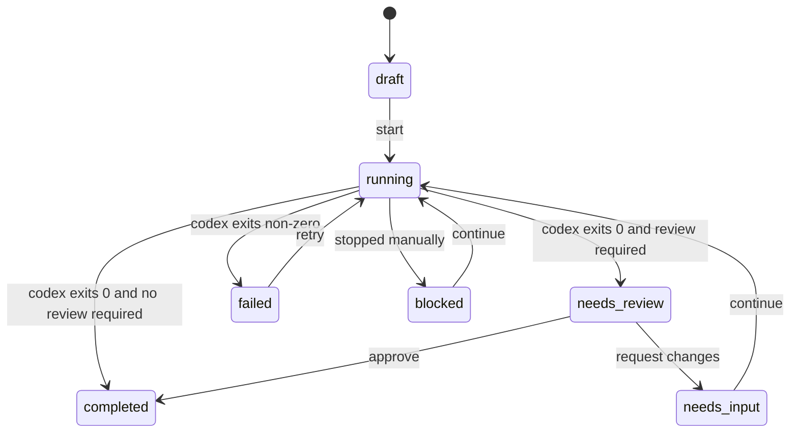

# Codex Manager Architecture

## Goal

Codex Manager is a local operator cockpit for Codex tasks. It borrows Symphony's runner,
workspace, tracker, and observability boundaries, but makes local task state the source of truth.

The design directly addresses the black-box limitation of a pure Symphony-style daemon:

- every task has a structured checklist;
- every run writes events to a persistent stream;
- Codex JSONL events are preserved separately from derived UI state;
- Human Review is a first-class status and workflow action;
- external trackers sync into the local model instead of replacing it.

## Core Model

- `Task`: canonical local task across local, GitHub, and GitLab sources.
- `ChecklistItem`: visible progress steps with operator-editable state.
- `TaskEvent`: append-only task timeline for orchestration, Codex events, sync, and review.
- `ExternalRef`: GitHub/GitLab binding for later bidirectional sync.
- `GitIdentity`: detected commit identity and API capability for each provider.

## Status Flow

## Important Extension Points

- `TaskSourceAdapter`: add GitHub/GitLab/Linear bidirectional sync and webhooks.
- `WorkspaceManager`: add SSH or remote GPU worker placement.
- `CodexRunner`: swap `codex exec --json` for app-server streaming when the protocol boundary is
  stable enough for richer intervention.
- `TaskEvent`: add richer typed payloads for tool calls, command outputs, PR links, screenshots,
  review packets, and test artifacts.
- `ReviewRequest`: the current implementation stores review as task status plus events; a future
  table can split review cycles if multi-review workflows become important.

## Why Not Directly Copy Symphony

Symphony's published spec intentionally focuses on scheduler/runner behavior and treats rich web UI
and persistent control-plane state as non-goals. Codex Manager keeps the useful runner skeleton but
adds the missing operator-facing state needed to manage many tasks without treating each run as a
black box.
